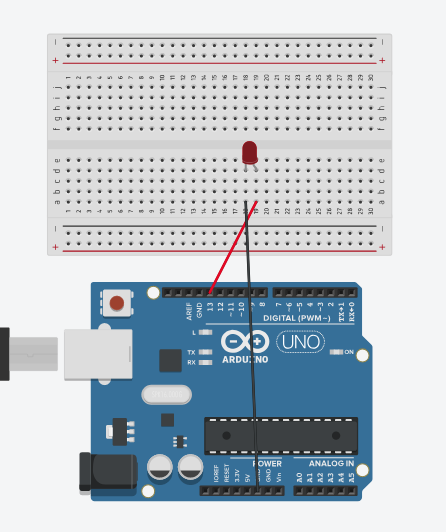
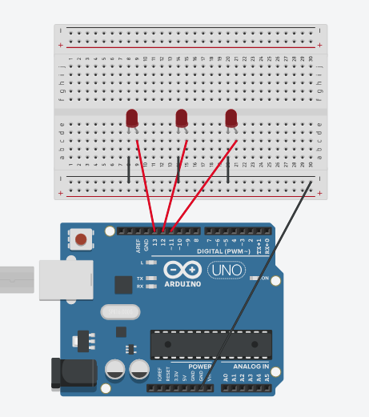
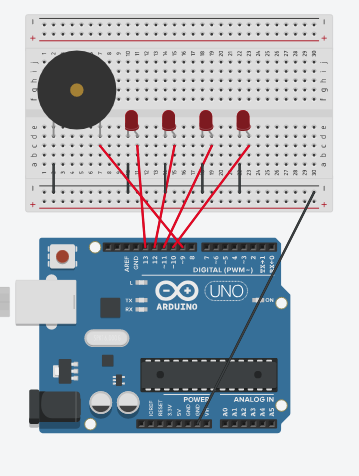
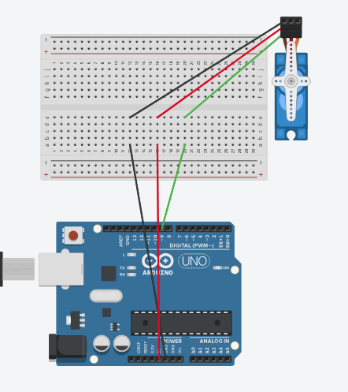
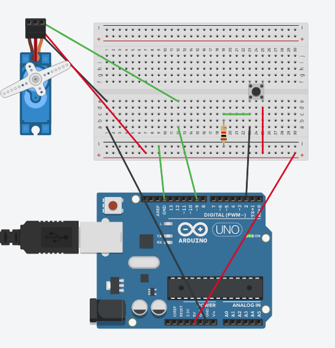
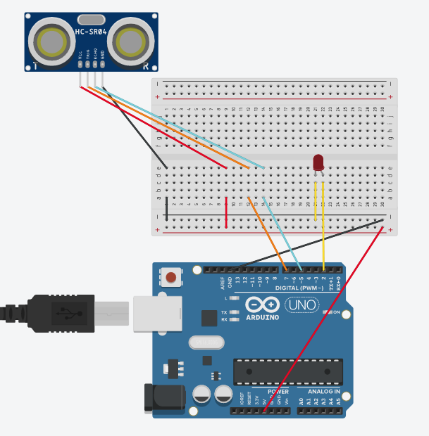

#Práctica 1

##Encender y apagar cada segundo

    void setup() {
      pinMode(13, OUTPUT);
    }

      void loop() {
        digitalWrite(13, HIGH);
        delay(1000);
        digitalWrite(13, LOW);
        delay(1000);
      }

+ Vídeo disponible al hacer click en la imagen.
  

#Práctica 2

##2.1 Encender y apagar consecutivamente

    int i;

    void setup() {
      for (i = 11 ; i <= 13 ; i++) {
        pinMode(i, OUTPUT);
      }
    }

    void loop() {
      for (i=11 ; i <= 13 ; i++) {
          digitalWrite(i , HIGH) ;
          delay (200) ;
          digitalWrite(i , LOW);
          delay (200) ;
      }
    }

+ Vídeo disponible al hacer click en la imagen.
  

##2.2 Encender y apagar cada vez más rápido

    int i;
    int j = 1000;

    void setup() {
      for (i = 11 ; i <= 13 ; i++) {
        pinMode(i, OUTPUT);
      }
    }

    void loop() {
      for (i=11 ; i <= 13 ; i++) {
          digitalWrite(i , HIGH);
          delay (j);
          digitalWrite(i , LOW);
          delay (j);
          if (j > 25) {
              j -= 25;
          }
      }
    }

+ Vídeo disponible al hacer click en la imagen.
  

##2.3 Encender y apagar todas a la vez (parpadeando 1 segundo)

    int i;

    void setup() {
      for (i = 11 ; i <= 13 ; i++) {
        pinMode(i, OUTPUT);
      }
    }

    void loop() {  
      digitalWrite(11 , HIGH) ;
      digitalWrite(12 , HIGH) ;
      digitalWrite(13 , HIGH) ;
      delay (1000) ;
      digitalWrite(11 , LOW);
      digitalWrite(12 , LOW) ;
      digitalWrite(13 , LOW) ;
      delay (1000) ;
    }

+ Vídeo disponible al hacer click en la imagen.
  

##2.4 Encender la 1 y la 3, se apagan y se enciende la 2

    int i;

    void setup() {
      for (i = 11 ; i <= 13 ; i++) {
        pinMode(i, OUTPUT);
      }
    }

    void loop() {
      
      digitalWrite(11 , HIGH) ;
      digitalWrite(12 , LOW) ;
      digitalWrite(13 , HIGH) ;
      delay (1000) ;
      digitalWrite(11 , LOW);
      digitalWrite(12 , HIGH) ;
      digitalWrite(13 , LOW) ;
      delay (1000) ;
    }

+ Vídeo disponible al hacer click en la imagen.
  

#Práctica 3

    int i;

    void setup() {
      for (i = 10; i <= 13; i ++) {
        pinMode(i, OUTPUT);
      }
    }

    void loop() {
      for (i = 10; i <= 13; i ++) {
        digitalWrite(i, HIGH) ;
        if (i == 13) {
          tone(9, 440);
        }
        delay (1000) ;
        noTone(9);
        digitalWrite(i, LOW);
        delay (1000) ;
      }
    }

+ Vídeo disponible al hacer click en la imagen.
  

#Práctica 4

    #include <Servo.h>
    Servo servo1;
    int angulo = 0;
    int pin = 9;
    void setup()
    {
      servo1.attach(pin) ;
    }

    void loop()
    {
      for(angulo = 0; angulo <= 180; angulo += 1)
          {
                servo1.write(angulo);
                delay(25);
          }
      for(angulo = 180; angulo >= 0; angulo -= 1)
          {
                servo1.write(angulo);
                delay(25);
          }
    }

+ Vídeo disponible al hacer click en la imagen.
  

#Práctica 5

    #include <Servo.h>
    Servo servo1;
    int angulo = 0;
    int pin = 9;
    void setup()
    {
      servo1.attach(pin) ;
      pinMode(2, INPUT);
    }

    void loop()
    {
      for(angulo = 0; angulo <= 180; angulo += 1)
      {
        while(digitalRead(2) == LOW) {
          delay(25);
        }
        servo1.write(angulo);
        delay(25);
        
      }
      for(angulo = 180; angulo >= 0; angulo -= 1)
      {
        while(digitalRead(2) == LOW) {
          delay(25);
        }
        servo1.write(angulo);
        delay(25);
      }
    }

+ Vídeo disponible al hacer click en la imagen.
  

#Práctica 6

    const int EchoPin = 5;
    const int TriggerPin = 7;
    
    void setup() {
      Serial.begin(9600);
      pinMode(TriggerPin, OUTPUT);
      pinMode(EchoPin, INPUT);
      pinMode(2, OUTPUT);
    }
    
    void loop() {
      int cm = ping(TriggerPin, EchoPin);
      Serial.print("Distancia: ");
      Serial.println(cm);
      if(cm <= 20) {
        digitalWrite(2, HIGH); 
      }
      else {
        digitalWrite(2, LOW);
      }
    }
    
    int ping(int TriggerPin, int EchoPin) {
      long duration, distanceCm;
      
      digitalWrite(TriggerPin, LOW);
      delayMicroseconds(4);
      digitalWrite(TriggerPin, HIGH);
      delayMicroseconds(10);
      digitalWrite(TriggerPin, LOW);
      
      duration = pulseIn(EchoPin, HIGH);
      
      distanceCm = duration * 10 / 292/ 2;
      return distanceCm;
    }

+ Vídeo disponible al hacer click en la imagen.
  
